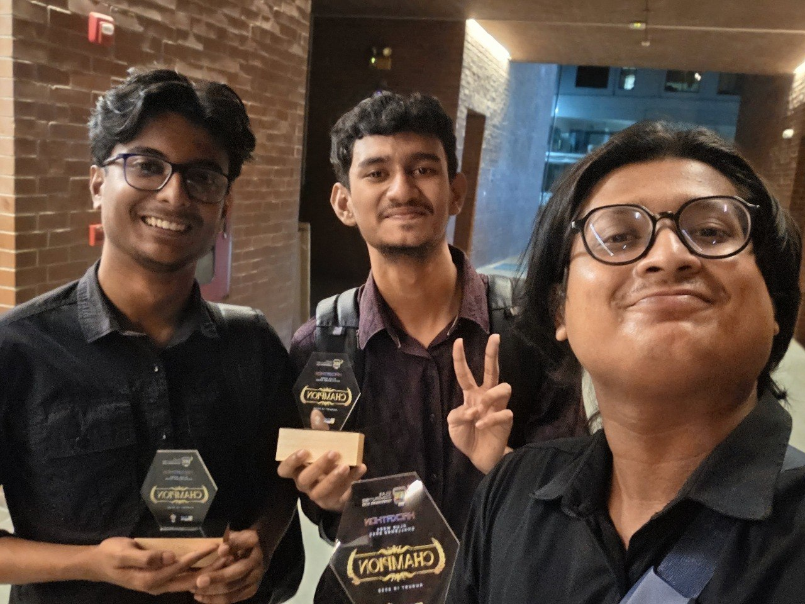
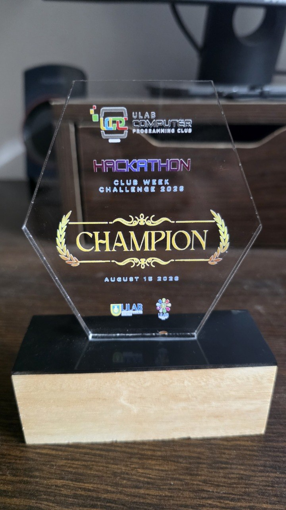
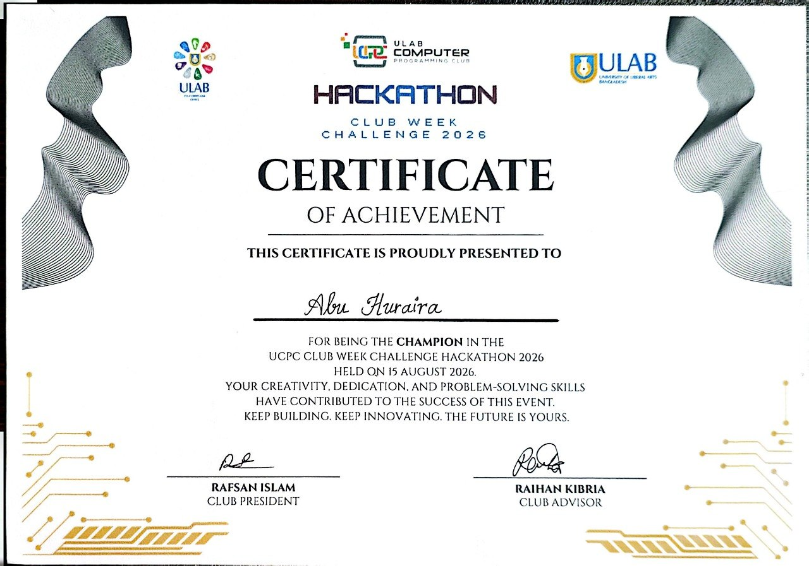

# SemesterView

**A unified academic assistant for university students — built and shipped in 3 hours.**

🏆 **1st Place — ULAB UCPC Hackathon (Club Week Challenge 2026)** · August 15, 2026
Team: *The Special One*

[Report an Issue](https://github.com/Hurairiam/SemesterView/issues)

---

## 🔗 Live Demo

**[https://data-analyzer--saifhasankhan19.replit.app/login](https://data-analyzer--saifhasankhan19.replit.app/login)**

## The Problem

University academic information is scattered across course routines in Excel, exam schedules in PDFs, academic calendars in separate PDFs, faculty details in disconnected systems, and research interests shared as images. Students juggle multiple sources just to answer simple questions like *"What's my next class?"* or *"Is this room free right now?"*

## The Solution

SemesterView consolidates schedules, exams, room availability, faculty information, and research opportunities into a single, personalized academic assistant — built and demonstrated using real ULAB CSE department data.

## Key Features

- **Personalized schedule** — students select their current courses and get a generated semester timetable
- **Free room finder** — cross-references the timetable to surface which rooms are open at a given time
- **Exam schedule & academic calendar** — pulled into one consistent view
- **Faculty directory & advisor selection** — with CSE research-area discovery
- **Research interest matching** — students indicate interests, relevant faculty can view them
- **Faculty view** — a separate login lets faculty check their day-by-day and full-semester schedule
- **Structured data pipeline** — university data (Excel, PDF, JSON) is normalized into structured JSON, making the app data-driven rather than hardcoded

## Why It Stood Out

Most student-assistant concepts at the event relied on hardcoded demo screens. SemesterView's data layer is driven by an OpenAPI contract that auto-generates matching Zod validators and a typed React client — meaning the frontend and backend share verified types end-to-end, rather than the UI just being wired to static mock data.

## Tech Stack

| Layer | Technology |
|---|---|
| Frontend | React, Vite, TypeScript, Tailwind CSS, Radix UI (shadcn/ui pattern) |
| Data Fetching / Forms | TanStack Query, React Hook Form, Zod |
| Backend | Express 5 (Node.js), Pino for logging |
| API Contract | OpenAPI spec → auto-generated Zod schemas & typed React client (via Orval) |
| Database | PostgreSQL (via Drizzle ORM) |
| Package Management | pnpm workspaces (monorepo) |
| Hosting | Replit |

**Architecture:**
```
React (Vite) Frontend
        │
        ▼
Typed API Client (generated from OpenAPI)
        │
        ▼
Express API Server ──▶ Drizzle ORM ──▶ PostgreSQL
```

The API contract is defined once in `openapi.yaml`, then Orval generates both the Zod validation schemas used by the backend and the typed API client consumed by the frontend — keeping request/response shapes in sync across the stack without hand-written duplication.

## Getting Started

This is a pnpm monorepo. Use `pnpm`, not `npm` or `yarn`.

```bash
# Clone the repository
git clone https://github.com/Hurairiam/SemesterView.git
cd SemesterView

# Install dependencies (workspace-wide)
pnpm install
```

Run the backend and frontend in separate terminals:

```bash
# Terminal 1 — API server
cd artifacts/api-server
pnpm dev

# Terminal 2 — Frontend
cd artifacts/semesterview
pnpm dev
```

The frontend dev server runs on Vite's default port; the API server runs separately alongside it.

> **Note:** The API server requires a `DATABASE_URL` environment variable pointing to a PostgreSQL instance (used by Drizzle ORM) before it will start.

## Roadmap

This was built as a hackathon prototype within a strict 3-hour window. Planned next steps include:

- University authentication with role-based access control (student / faculty / admin)
- Persistent database-backed course, advisor, and research selections
- Live university API integration in place of static data imports
- Faculty email notifications for matched research interests
- Support for departments beyond CSE
- Optional AI-powered natural-language query layer on top of verified data

## Team — The Special One

| Name | Contribution |
|---|---|
| **Abu Huraira** | Core idea, product direction, feature planning, data structure & technical decisions |
| **Saif Hasan Khan** | JSON/data architecture, presentation & pitching |
| **Tanvir** | Presentation preparation and delivery |

## Event Details

Built in a 3-hour sprint on **August 15, 2026** for the **ULAB UCPC Hackathon — Club Week Challenge 2026**, organized by the ULAB Computer Programming Club (UCPC), competing against ~9 teams on problem understanding, technical implementation, functionality, UX, and presentation.

## Gallery

<table>
  <tr>
    <td align="center">
      <br>
      <sub><em>The Special One at the ULAB UCPC Hackathon</em></sub>
    </td>
  </tr>
  <tr>
    <td align="center">
      <br>
      <sub><em>Champion Crest</em></sub>
    </td>
  </tr>
  <tr>
    <td align="center">
      <br>
      <sub><em>Certificate of Achievement</em></sub>
    </td>
  </tr>
</table>

---

<p align="center">Built with ☕ and a strict 4:00 PM deadline.</p>
